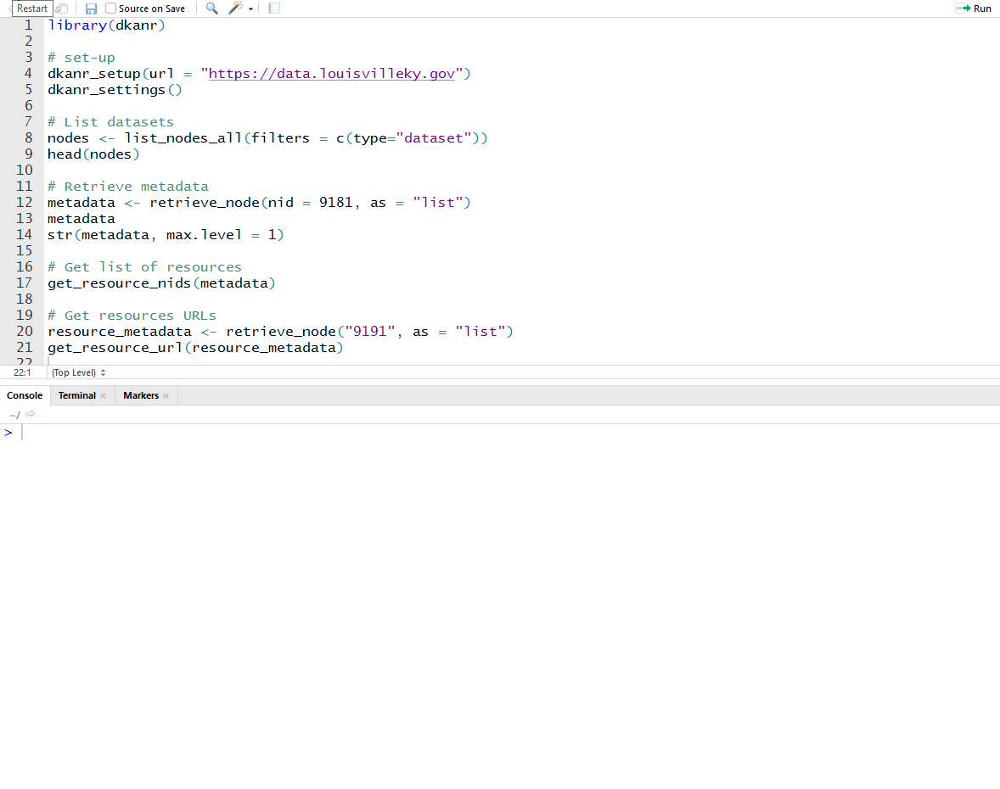

[](https://travis-ci.org/tonyfujs/dkanr)
[](https://ci.appveyor.com/project/tonyfujs/dkanr)
[](https://codecov.io/github/tonyfujs/dkanr?branch=master)
[](https://cran.r-project.org/package=dkanr)
[](http://choosealicense.com/)
[](http://www.repostatus.org/#wip)
[](https://github.com/dkanr)

# dkanr

[DKAN](https://getdkan.org/) is an open data platform that enables publication and consumption of open data.

The `dkanr` package is an R client to the [DKAN REST API](https://dkan.readthedocs.io/en/latest/apis/rest-api.html) that aims to facilitate the consumption, updating, and publication of content to open data platforms powered by DKAN. 

## Installation

You can install the released version of dkanr from [CRAN](https://CRAN.R-project.org) with:

``` r
install.packages("dkanr")
```

And the development version from [GitHub](https://github.com/) with:

``` r
# install.packages("devtools")
devtools::install_github("tonyfujs/dkanr")
```
## Example



To learn more about the features and functionalities of the package, view the Getting Started with dkanr [vignette](https://github.com/tonyfujs/dkanr/blob/master/vignettes/getting_started_with_dkanr.Rmd) for basic guidelines on how to use the package.

```r
browseVignettes(package = "dkanr")
```

